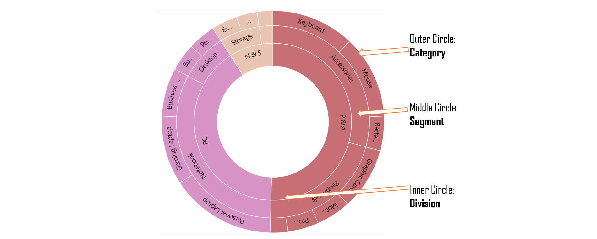
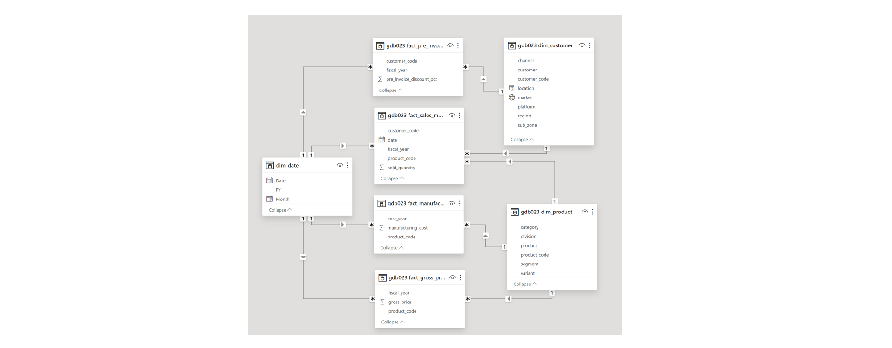

# Consumer-Goods-Domain-Insights-and-Adhoc-queries

- [Dashboard](https://app.powerbi.com/view?r=eyJrIjoiMTQ4N2JiM2ItZjFkZC00NjdiLTlhNGMtNGUzNTJiNTlmNGM4IiwidCI6ImM2ZTU0OWIzLTVmNDUtNDAzMi1hYWU5LWQ0MjQ0ZGM1YjJjNCJ9)

  
## Table of Contents
- [Project Overview](#Project-Overview)
- [Problem Statement](#Problem-Statement)
- [Task](#Task)
- [Tool Used](#tool-used)
- [Quick Introduction](#quick-introduction)
  - Product
  - Customer
  - Region, Market
  - Data Model
- [Adhoc Questions](#Ad-hoc-Requests)

## Project Overview:

Provide Insights to Management in the Consumer Goods Domain.

## Problem Statement:

Atliq Hardware, a global computer hardware manufacturer, needs better data insights for decision-making. It is hiring new data analysts who have technical and soft skills. It has a SQL challenge to evaluate the candidates’ SQL and visualization skills using sales and financial data from Atliq Hardware. The candidates have to use SQL scripts, Power BI visuals, and reports that answer specific questions about the company’s performance. The SQL challenge is a way to find the best fit for the data analytics team.

## Task:

-  Review the Ad-hoc Requests and understand the specific requirements.
-  Implement SQL Queries to provide meaningful insights.
-  Leverage visualization tools and techniques to present data in an easily digestible format.
-  Consider that the target audience is top-level management.
-  Make a video presentation.

## Tool Used:

- MySQL
- Power BI
- PowerPoint
- Youtube

 ## Quick Introduction 
 
AtliQ Hardware is a computer hardware and peripherals manufacturer. 

- dim_product: contains product-related data. **Products** are broadly classified into 

> Division -> Segment -> Category -> Products -> Variants

 
-dim_customer: contains customer-related data **Customer**
  
  Atliq`s has Brick & Mortar and E-Commerce customers, This is called their **platform**.
  They sell their goods through different **channels**: Retailer, Direct, Distributor.

- **Region / Market**
The customer base is classified into 4 regions: APAC, EU, NA, and LATAM.
They have their business established in the following countries:

- **Fiscal Year**

- **Data Model**

## Ad-hoc Requests:

1. Provide the list of markets in which customer "Atliq Exclusive" operates its business in the APAC region.
2. What is the percentage of unique product increase in 2021 vs. 2020?
   The final output contains these fields:
    - unique_products_2020
    - unique_products_2021
    - percentage_chg
3. Provide a report with all the unique product counts for each segment and sort them in descending order of product counts.
   The final output contains 2 fields:
    - segment
    - product_count

4. Follow-up: Which segment had the most increase in unique products in 2021 vs 2020?
   The final output contains these fields:
    - segment
    - product_count_2020
    - product_count_2021
    - difference

5.  Get the products that have the highest and lowest manufacturing costs.
    The final output should contain these fields,
    - product_code
    - product
    - manufacturing_cost
      
6. Generate a report that contains the top 5 customers who received an average high pre_invoice_discount_pct for the fiscal year 2021 and in the Indian market.
   The final output contains these fields:
    - customer_code
    - customer
    - average_discount_percentage
7. Get the complete report of the Gross sales amount for the customer “Atliq Exclusive” for each month. This analysis helps to get an idea of low and high-performing months and take strategic decisions.
  The final report contains these columns:
    - Month
    - Year
    - Gross sales Amount
8. In which quarter of 2020, got the maximum total_sold_quantity?
   The final output contains these fields:
    - sorted by the total_sold_quantity,
    - Quarter
    - total_sold_quantity
9. Which channel helped to bring more gross sales in the fiscal year 2021 and the percentage of contribution?
    The final output contains these fields:
    - channel
    - gross_sales_mln
    - percentage
10. Get the Top 3 products in each division that have a high total_sold_quantity in the fiscal_year 2021.
    The final output contains these:
    - fields,
    - division
    - product_code
